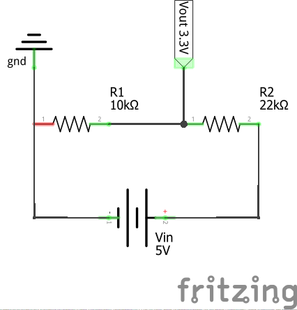

Mohon menjawab pertanyaan yang ada dibawah ini, untuk menjawabnya kalian dapat *copy* seluruh pertanyaan dan kemudian tuliskan jawabannya dibawah setiap pertanyaan dan berikan step by step pengerjaannya. Untuk jenis file yang dikumpulkan dapat berupa sebuah file txt atau file MD atau foto kertas tempat kalian mengerjakan assignmentnya dan sertakan juga foto/gambar pendukung dari step by step yang kalian kerjakan. Contoh pengerjaan:

1. Sebutkan total resistor di titik 2
    
    R1 + R2 + R3 = 20Ω rangkaian seri
    
    1/R4 + 1/R5 + 1/R6 = 30Ω rangkaian parallel
    
    Total hambatan = 20Ω + 30Ω = 50Ω
    

---

## Pertanyaan

1. Buatlah sebuah rangkaian listrik menggunakan konsep voltage divider, dimana diberikan Vin = 5v dan Vout = 3.3V! ( Sertakan gambar schematic pada jawabannya! )

**Jawaban Soal Nomor 1**

2. Berapakah $VR2$ pada rangkaian berikut?

**Jawaban Soal Nomor 2**

I   
V/Rtot
    
= 30/30

= 1A

VR2 = I2 x R2

= 1 x 10
    
= 10V

3. Berapakah total hambatan dalam rangkaian berikut:

**Jawaban Soal Nomor 3**

Rs 1 = R1 + R2

= 3 + 3 = 6

Rs 2 = R3 + R4

= 3 + 3 = 6

Rptot1 = 1/6 + 1/6

= 2/6

1/Rp = 2/6

Rp1 = 6/2 = 3

Rptot2 = 1/4 + 1/4

= 2/4

1/Rp = 2/4

Rp2 = 4/2 = 2

Rtot = Rp1 + R5 + Rp2

= 3 + 5 + 2

= 10 Ohm